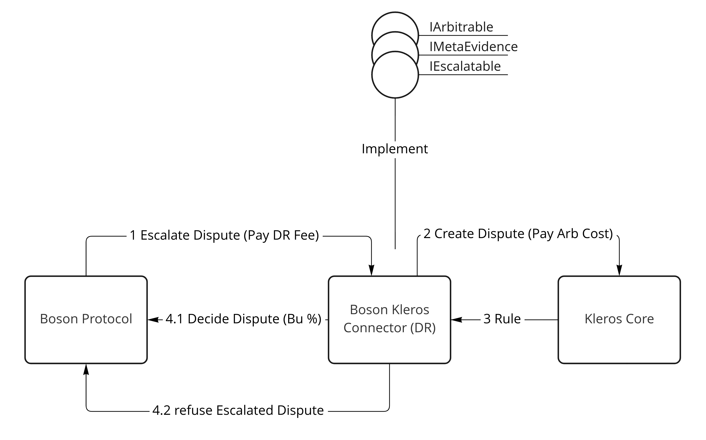
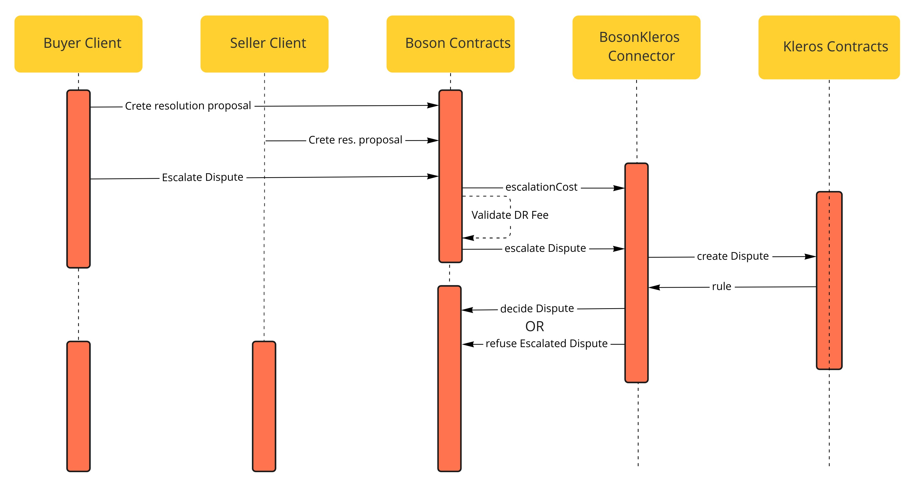

## Abstract

The following proposal outlines the integration of Kleros Protocol with Boson Protocol as a decentralized Dispute Resolver (DR). In Boson Protocol, DR serves as the last resort for dispute resolution when mutual resolution between buyer and seller fails.

## Motivation

As Boson Protocol follows the path of progressive decentralization, it's important to ensure that there is no full dependencies on centralized parties.

Boson Protocol enables trust-minimized commercial transactions. In case a dispute arises between the counterparites about the exchange, the two-step dispute resolution is appled: mutual resolution and escalation dispute resolution.

Escalated dispute resolution creates a centralized element in the protocol. In some use cases a centralized DR is good enough to resolve a disagreement between counterparties. But there are use cases when a centralized DR may jeopardize trust. Therefore an option to use an incentive-compatible decentralized DR is important. Kleros Protocol is one of the most tested and widely used decentralized dispute resolution systems on-chain.

## Specification

In order to implement integration of Kleros Protocol the following changes have to be made

- Expose interfaces for an external system to interact with the escalated dispute resolution process
- Implement changes to keep the state of buyer and seller mutual resolution proposals on-chain
- Implement a "Connector" smart contract that implements `IArbitrable`, `IMetaEvidence` and `IEvidence` Kleros interfaces. And implements Boson Protocol interfaces for dispute resolution interfaces
- Create a dedicated marketplace sub-court by submitting a proposal to the Kleros DAO

### Boson Protocol Changes

**IEscalatable interface**

```solidity
interface IEscalatable {
    function escalateDispute(
        uint256 _exchangeId,
        uint256 _buyerPercent,
        uint256 _sellerPercent
    ) external;

    function escalationCost() external returns (uint256 _cost);
}
```

**IEscalationResolver**

```solidity
interface IEscalationResolver {
    function decideDispute(uint256 _exchangeId, uint256 _buyerPercent) external;

    function refuseEscalatedDispute(uint256 _exchangeId) external;
}
```

**contracts/interfaces/handlers/IBosonDisputeHandler.sol**

Modification to the existing IBosonDisputeHandler interface

```solidity

    /**
     * @notice Resolves a dispute by providing the information about the funds split.
     * Callable by the buyer and seller
     * @param _exchangeId  - the id of the associated exchange
     * @param _percent - percentage of the pot that goes to the buyer
     */
    function resolveDispute(uint256 _exchangeId, uint256 _percent) external;
```





## Rationale

## Backward compatibility

/

## Implementation

https://github.com/bosonprotocol/boson-protocol-contracts/pull/488/

## Copyright waiver & license

Copyright and related rights waived via [CC0](https://creativecommons.org/publicdomain/zero/1.0/).
